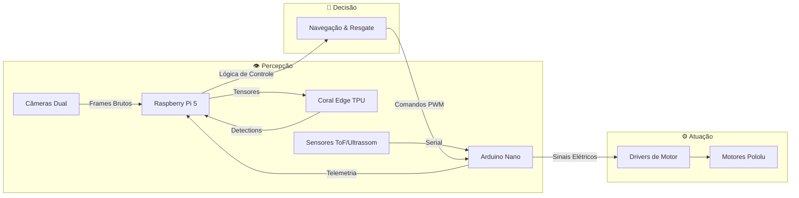

---

/ _ \| _ \| _ \ | | | | / / | | / /
| | | | |_) | |_) || | | |/ / | |/ /
| |_| | _ <| _ < | |**\_ | |\ \ | |\ \
\_**/|\_| \_\_| \_\|**\_**||_| \_\ |_| \_\


# Visão Geral do Projeto

**Robô de Resgate de Alta Performance** baseado na arquitetura _Overengineering²_ (Campeões da RoboCup 2024). Este projeto visa criar um sistema autônomo robusto capaz de navegar em ambientes complexos de resgate, identificar vítimas e superar obstáculos com precisão cirúrgica.

### 🚀 Tecnologias Chave

- **Visão Computacional Híbrida**: Fusão de YOLOv8 (Infeferência na Borda via Coral TPU) para detecção de objetos e OpenCV clássico para seguimento de linha de ultra-baixa latência.
- **Multiprocessamento**: Arquitetura de software paralela utilizando todos os núcleos do Raspberry Pi 5 para separar Controle, Visão e Comunicação Serial.
- **Hardware Dedicado**: Chassi híbrido de tanque e sistema de dupla bateria para isolamento total de ruído elétrico.

---

# 🧠 Arquitetura do Sistema

O fluxo de dados é projetado para minimizar a latência entre a percepção e a atuação.



---

# ⚡ Distribuição de Energia

Sistema de **Dupla Bateria** para garantir que o processamento lógico nunca sofra interferência das altas correntes dos motores.

```mermaid
graph TD
    subgraph Logic [🔵 Circuito Lógico (Clean)]
        Bat1[LiPo 7.4V] --> UBEC[UBEC 5V/3A]
        UBEC --> Pi[Raspberry Pi 5]
        Pi --> Coral
    end

    subgraph Power [🔴 Circuito de Potência (Dirty)]
        Bat2[LiPo 11.1V] --> Emer[Chave Emergência]
        Emer --> Driver[Driver Ponte H]
        Driver --> Motor[Motores DC]
    end
```

_Veja detalhes completos em [docs/power_management.md](docs/power_management.md)_

---

# 🗺️ Roadmap & Progresso

### 🛠️ Montagem de Hardware

- [x] Design do Chassi Híbrido
- [x] Integração dos Motores Pololu
- [ ] Montagem Final do Manipulador
- [ ] Cabeamento e Isolamento Elétrico

### 🧠 Inteligência Artificial

- [x] Treinamento do Modelo YOLOv8n (Vítimas/Vieses)
- [x] Compilação para EdgeTPU (.tflite)
- [x] Integração Multiprocessada (Python)
- [ ] Otimização de Dataset para Vítimas Flutuantes

### 🏎️ Testes de Pista

- [x] Teste de Bancada (Motores/Sensores)
- [x] Simulação de Lógica Omni-Drive
- [ ] Validação de Desvio de Obstáculos
- [ ] Teste de Resgate Completo (Bancada -> Área de Resgate)

---

# 📥 Instalação e Uso

### Pré-requisitos

- Raspberry Pi 5 com Raspberry Pi OS (64-bit)
- Google Coral USB Accelerator
- Python 3.11+

### Configuração Rápida

```bash
# 1. Clone o repositório no Raspberry Pi
git clone https://github.com/DaviBonetto/OBR_2026.git
cd OBR-2026-Rescue-HighPerformance

# 2. Execute o script de instalação automática
# Instala drivers Coral, OpenCV e configura permissões
chmod +x scripts/setup_pi.sh
./scripts/setup_pi.sh

# 3. Ative o ambiente e execute
source venv/bin/activate
cd src/Python/main
python main.py
```
